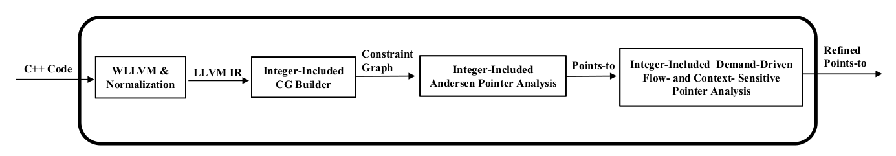

# [TIPS: Tracking Integer-Pointer Value Flows for C++ Member Function Pointers](https://doi.org/10.1145/3660779)


**ACM Reference Format**

```
Changwei Zou, Dongjie He, Yulei Sui, and Jingling Xue. FSE 2024. 

TIPS: Tracking Integer-Pointer Value Flows for C++ Member Function Pointers. 

Proc. ACM Softw. Eng. 1, FSE, Article 72 (July 2024), 23 pages. 

https://doi.org/10.1145/3660779
```
## Overview

|The workflow of Tips|
|:-------------:|
|  |

## 1. How to Build TIPS 

### 1.1. Download TIPS


```sh
$ git clone https://github.com/sheisc/TIPS.git

$ cd TIPS

TIPS $ pwd

/path/to/TIPS

```

## 1.2. Install LLVM and Z3

```sh
TIPS$ pwd

/path/to/TIPS

TIPS$ ./installLLVM.sh

```

## 1.3. Install [WLLVM](https://github.com/travitch/whole-program-llvm)

```sh
TIPS$ pwd

/path/to/TIPS

TIPS$ sudo apt install python3-virtualenv

TIPS$ ./installWLLVM.sh

```

## 1.4. Build the Original SVF

[Install cmake](https://github.com/svf-tools/SVF/wiki/Setup-Guide#getting-started)

```sh
$ sudo apt install cmake gcc g++ libtinfo5 libz-dev zip wget libncurses5-dev
```

Build SVF


```sh

TIPS$ pwd

/path/to/TIPS

TIPS$ source ./set_envs.sh

(venv)$ cd SVF.ORIG

(venv)$ ./build.sh

(venv)$ cd ..

(venv)$ deactivate

TIPS$

```

## 1.5. Build TIPS

```sh

TIPS$ pwd

/path/to/TIPS

TIPS$ source ./set_envs.sh

(venv)$ cd SVF.TIPS

(venv)$ ./build.sh

(venv)$ cd ..

(venv)$ deactivate

TIPS$

```

## 2. How to Run TIPS 

## 2.1 System Environment

<b>
To test MicroBenchmarks, a daily-use desktop environment is sufficient.
</b>

<b>
However, pointer analysis consumes much more memory in analyzing larger C++ programs.
</b>

Our analysis environment consisted of a 3.50 GHz Intel Xeon E5 CPU, 
equipped with 512 GB of memory, and operated on a 64-bit Ubuntu 20.04 OS.

## 2.2 Test MicroBenchmarks

```sh

TIPS$ pwd

/path/to/TIPS

TIPS$ source ./set_envs.sh

(venv)$ cd Benchmarks

(venv)$ ./MicroBenchmark.sh

(venv)$ cd ..

(venv)$ deactivate

TIPS$

```

The report is put at the directory **Benchmarks/MicroBenchmark/result**.


## 2.3 Test CPU2006

```sh

TIPS$ pwd

/path/to/TIPS

TIPS$ source ./set_envs.sh

(venv)$ cd Benchmarks

(venv)$ make TEST_CPU2006

(venv)$ cd ..

(venv)$ deactivate

TIPS$

```

Brief reports are generated in **Benchmarks/CPU2006/report.tips.txt and Benchmarks/CPU2006/report.orig.txt**, respectively.

More details are given in **Benchmarks/CPU2006/report/**.

## 2.4 Test Twelve Open Source C++ Programs

```sh

TIPS$ pwd

/path/to/TIPS

TIPS$ source ./set_envs.sh

(venv)$ cd Benchmarks

(venv)$ make TEST_Major

(venv)$ cd ..

(venv)$ deactivate

TIPS$

```

Brief reports are generated in **Benchmarks/Major/report.tips.txt and Benchmarks/Major/report.orig.txt**, respectively.

More details are given in **Benchmarks/Major/report/**.

## 3. Directory

```sh

TIPS$ tree -L 1


├── Benchmarks                             Including our microbenchmarks, CPU2006 and open-cource c++ programs
├── installLLVM.sh                         Shell script for installing LLVM and Z3
├── installWLLVM.sh                        Shell script for installing WLLVM
├── llvm-14.0.0.obj                        LLVM14.0.0
├── README.md                              Read me
├── set_envs.sh                            Shell for setting environment variables
├── SVF.ORIG                               The source code of the original SVF
├── SVF.TIPS                               The source code of TIPS
├── whole-program-llvm                     WLLVM
└── z3.obj                                 Z3


```
